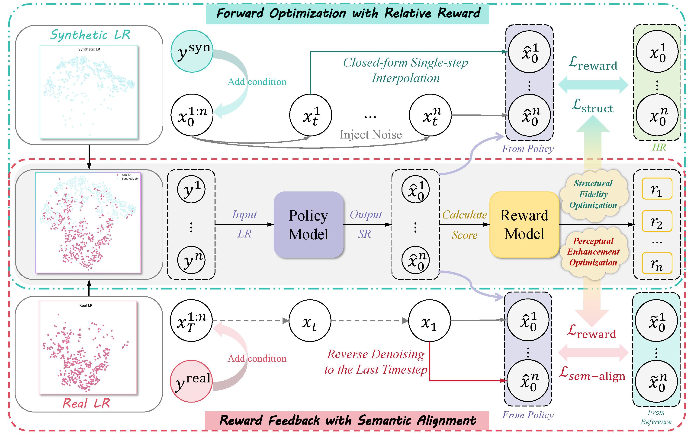

# Bird-SR: Bidirectional Reward-Guided Diffusion for Real-World Image Super-Resolution

<a href='https://arxiv.org/abs/2602.07069'></a> &nbsp;&nbsp;
<a href='https://github.com/fanzh03/Bird-SR'></a> &nbsp;&nbsp;

This is the official PyTorch implementation of the paper:

>**Bird-SR: Bidirectional Reward-Guided Diffusion for Real-World Image Super-Resolution**<br>





## :wrench: Dependencies and Installation

1. Clone repo

```bash
git clone https://github.com/fanzh03/Bird-SR.git
cd Bird-SR
```

2. Install packages
```bash
conda env create -f environment.yaml
conda activate dit4sr
```


## :surfer: Quick Start


**Step 1: Download Checkpoints**

- Download the [[Dit4SR checkpoints](https://huggingface.co/acceptee/DiT4SR)] and place them in: `preset/models/Dit4SR`.
- Download the [[Bird-SR checkpoints](https://drive.google.com/drive/folders/1Hl5vHCqx88T9lMcgxnXzKyXRIi4FgBCT?usp=sharing)] and place them in: `preset/models/bird_sr`.
- Download the [[stable-diffusion-3.5-medium](https://huggingface.co/stabilityai/stable-diffusion-3.5-medium)] and place it in: `preset/models/stable-diffusion-3.5-medium`.
- Download the [[clip-vit-large-patch14-336](https://huggingface.co/openai/clip-vit-large-patch14-336)] and [[llava-v1.5-13b](https://huggingface.co/liuhaotian/llava-v1.5-13b)] and place them in: `llava_ckpt/`.

**Step 2: Prepare testing data**

Place low-quality images in `preset/datasets/test_datasets/`.
You can download `RealSR`, `DrealSR` and `RealLR200` from [[SeeSR](https://drive.google.com/drive/folders/1L2VsQYQRKhWJxe6yWZU9FgBWSgBCk6mz)], 
and download `RealLQ250` from [[DreamClear](https://drive.google.com/file/d/16uWuJOyGMw5fbXHGcl6GOmxYJb_Szrqe/view)].

**Step 3: Run inference**

```bash
# test without LLaVA caption (one GPU is enough)
bash bash/test_wllava.sh

# test with LLaVA caption (two GPUs are required)
bash bash/test_wollava.sh
```
Replace the placeholders `[pretrained_model_name_or_path]`, `[transformer_model_name_or_path]`, `[image_path]`, `[output_dir]`, and `[prompt_path]` with their respective paths before running the command.

**Step 4: Check the results**

The processed results will be saved in the `[output_dir]` directory.


## :gift: Gradio Demo

We provide a Gradio demo for Bird-SR:
```bash
CUDA_VISIBLE_DEVICES=0,1 python gradio_dit4sr.py \
    --transformer_model_name_or_path "preset/models/bird_sr" 
```


## :muscle: Train

**Step 1: Download the training data**

Download the training datasets including `DIV2K`, `DIV8K`, `Flickr2K`, `Flickr8K`, and [[NKUSR8K](https://huggingface.co/datasets/acceptee/NKUSR8K)].

**Step 2: Prepare the training data**

- Generate LR-HR pairs: `bash bash_data/make_pairs.sh`
- Generate prompts for each HR image: `bash bash_data/make_prompt.sh`
- Generate latent codes for HR and LR images: `bash bash_data/make_latent.sh`
- Generate prompt embeddings: `bash bash_data/make_embedding.sh`
- Download [[NULL_pooled_prompt_embeds.pt and NULL_prompt_embeds.pt](https://huggingface.co/acceptee/DiT4SR)] and place them in the corresponding directories.

**Data Structure After Preprocessing**

```
preset/datasets/training_datasets/ 
    └── gt
        └── 0000001.png # GT images, (3, 512, 512)
    └── sr_bicubic
        └── 0000001.png # Bicubic LR images, (3, 512, 512)
    └── prompt_txt
        └── 0000001.txt # prompts
    └── prompt_embeds
        └── NULL_prompt_embeds.pt # SD3 prompt embedding tensors, (154, 4096)
        └── 0000001.pt 
    └── pooled_prompt_embeds
        └── NULL_pooled_prompt_embeds.pt # SD3 pooled embedding tensors, (2048,)
        └── 0000001.pt 
    └── latent_hr
        └── 0000001.pt # SD3 latent space tensors, (16, 64, 64)
    └── latent_lr
        └── 0000001.pt # SD3 latent space tensors, (16, 64, 64)
```

**Step 3: Train the base model (DiT4SR)**

```bash
bash bash/train.sh
```

**Step 4: Train with Bidirectional Reward (Bird-SR)**

```bash
bash bash/train_rl.sh
```


## :book: Citation

If you find our repo useful for your research, please consider citing our paper:

```bibtex
@article{fan2025birdsr,
  title={Bird-SR: Bidirectional Reward-Guided Diffusion for Real-World Image Super-Resolution},
  author={},
  journal={arXiv preprint arXiv:2602.07069},
  year={2025}
}
```

## :pray: Acknowledgment

This code is based on [DiT4SR](https://github.com/Adam-duan/DiT4SR) and [ImageReward](https://github.com/zai-org/ImageReward). Thanks for their awesome work.

## :postbox: Contact

For technical questions, please contact the authors.

## License

This project is licensed under the Pi-Lab License 1.0 - see the [LICENSE](LICENSE) file for details.
